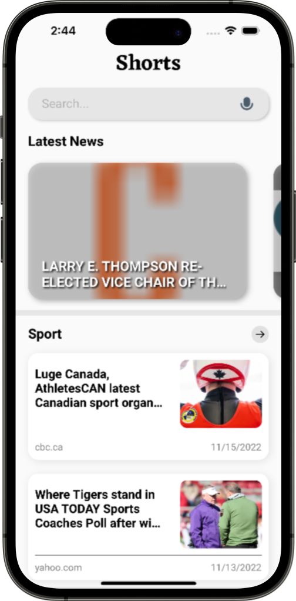
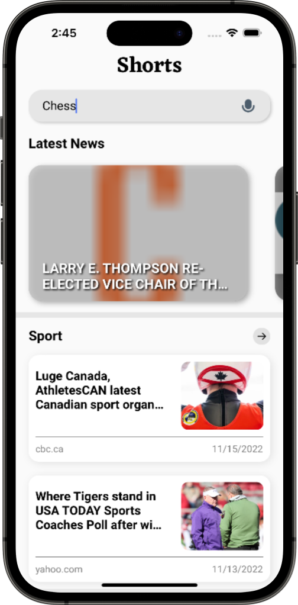
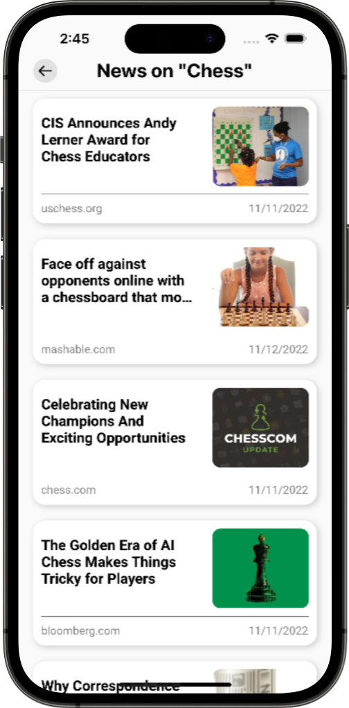
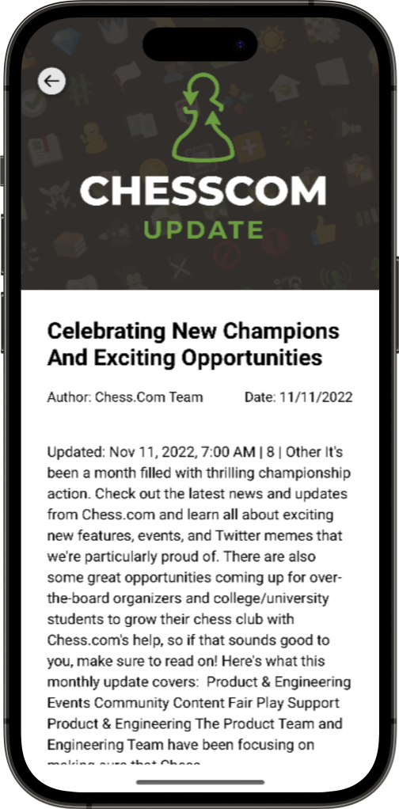
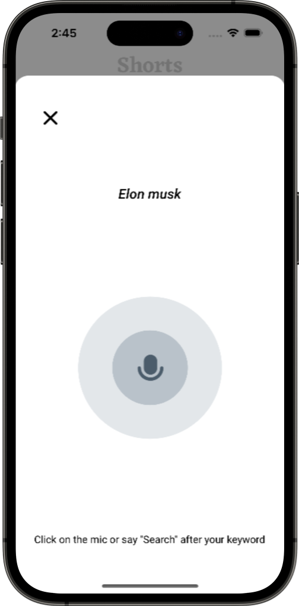
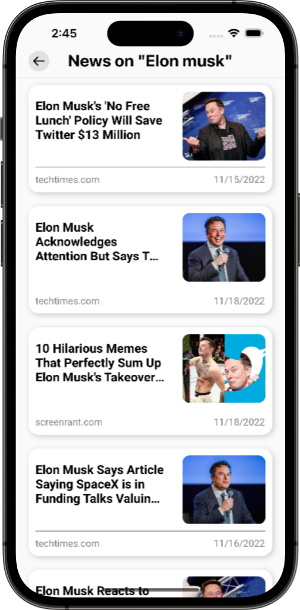

# Shorts

## Project Proposal

**Problem:** Time is of the biggest importance to humans in our fast-paced society, hence it is crucial that the items he/she consumes are likewise time-efficient. People these days have a relatively short attention span, so we attempt to make the most of the little extra time that we have. So the question is, how can we encourage the most user interaction given the user's limited attention span?

**Solution:** It is crucial that our apps operate quickly in this fast-paced environment. The user could make the most of his time if he could access the most information in the shortest amount of time possible. And so I have come up with an application called - **Shorts**. It’s aimed at people who love to stay updated with the current news but struggle to find some wiggle room to watch their favorite news channels or the ones who don’t really like reading the newspaper but prefer getting their daily dose of the news from online resources or for people who want to inculcate a new habit of reading news, this application is the perfect place. The app provides news of a variety of categories in form of a brief descriptive <b>summary</b> of each news. Cutting through all the unnecessary noise that is usually included in online news articles, this app aims to serve you only the important content and save you your time.

## Tech Stack and API

- **React Native:** React Native combines the best parts of native development with React, a best-in-class JavaScript library for building user interfaces.
- **News Catcher API:** This API allows users to locate articles and breaking news headlines from news sources and blogs across the web. Link: https://newscatcherapi.com/

## UI Wireframing

<b>Home Page</b>

 
 
 
 

 &nbsp  Search Bar  &nbsp &nbsp &nbsp &nbsp &nbsp &nbsp &nbsp &nbsp &nbsp &nbsp &nbsp &nbsp &nbsp &nbsp &nbsp &nbsp &nbsp &nbsp  Search Result</img>

 

<b>Textual Search Functionality</b>

 
 
 
 

<b>News Page</b>

 
 
 
 

<b>Voice activated Search</b>

 

## Final Outcome:

 

<b>Home Page</b>

 
 
 
 

 &nbsp &nbsp  &nbsp &nbsp &nbsp &nbsp  &nbsp  Search Bar  &nbsp &nbsp &nbsp &nbsp &nbsp &nbsp &nbsp &nbsp &nbsp &nbsp &nbsp &nbsp &nbsp &nbsp &nbsp &nbsp &nbsp &nbsp  Search Result</img>        News Page

 

<b>Textual Search Functionality</b>

 
 
 
 

 &nbsp &nbsp  &nbsp &nbsp &nbsp &nbsp  &nbsp  Search Bar  &nbsp &nbsp &nbsp &nbsp &nbsp &nbsp &nbsp &nbsp &nbsp &nbsp &nbsp &nbsp &nbsp &nbsp &nbsp &nbsp &nbsp &nbsp  Search Result</img>        News Page

<b>Voice activated Search</b>

 

## Steps to run the project:

**1. Setup React Native CLI -**

- If you are developing on a Mac, make sure you have XCode downloaded and updated on your machine. Make sure to also include the appropriate IOS Device Support Files required for XCode. You can download and include those from this link:
  https://github.com/filsv/iOSDeviceSupport

- Note💡: You cannot develop an IOS application on a windows PC.

- Follow along this blog to setup React Native CLI on your Mac M1:
  https://fek.io/blog/how-to-set-up-react-native-on-m-1-mac-2022-edition

- Alternatively, you can also go through React Native's official documentation for React Native CLI Quickstart:
  https://reactnative.dev/docs/environment-setup

- **For Android:**
  Install Android studio and Android emulator if building for android device

**2. Clone the repo -**

- Once you are done setting up React Native CLI on your machine, open a new folder and clone the repo.

**3. How to run -**

- Create account on NewsCatcher API
- Create a new apis folder inside src folder and create an API.js file.
- Add your NewsCatcher API key to the API.js as API_TOKEN
- Additionally, also include the base URI - https://api.newscatcherapi.com/v2/ for NewsCatcher as API_URL in API.js
- Run `npm install` to install node dependencies from the package.json.
- If building project for IOS
  - Run `cd ios` and then pod install to install pod dependencies. Run `cd ..` to go back to root directory of the app
  - Follow the instructions [here](https://github.com/aiba/react-native-m1) to prevent/debug build
- Run the app from terminal with `npm run ios` or `npm run android`
