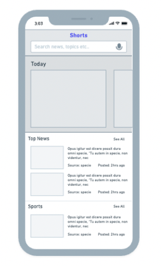
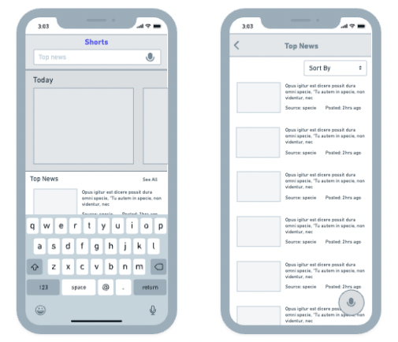
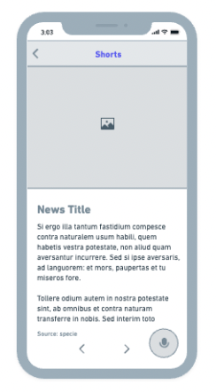
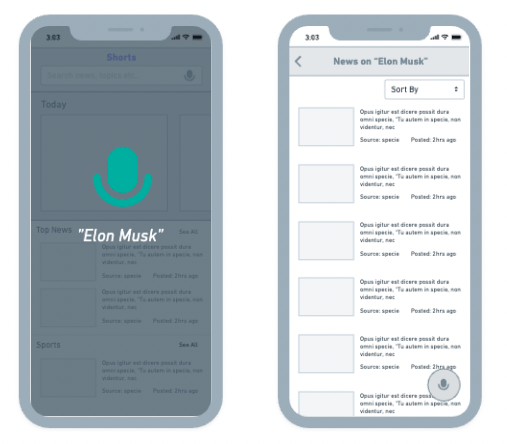

# Shorts

## Project Proposal

**Problem:** Time is of the biggest importance to humans in our fast-paced society, hence it is crucial that the items he/she consumes are likewise time-efficient. People these days have a relatively short attention span, so we attempt to make the most of the little extra time that we have. So the question is, how can we encourage the most user interaction given the user's limited attention span?

**Solution:** It is crucial that our apps operate quickly in this fast-paced environment. The user could make the most of his time if he could access the most information in the shortest amount of time possible. And so I have come up with an application called - **Shorts**. It’s aimed at people who love to stay updated with the current news but struggle to find some wiggle room to watch their favorite news channels or the ones who don’t really like reading the newspaper but prefer getting their daily dose of the news from online resources or for people who want to inculcate a new habit of reading news, this application is the perfect place. The app provides news of a variety of categories in form of a brief descriptive <b>summary</b> of each news. Cutting through all the unnecessary noise that is usually included in online news articles, this app aims to serve you only the important content and save you your time.

## Tools & Technologies

- **React Native:** React Native combines the best parts of native development with React, a best-in-class JavaScript library for building user interfaces.
- **News Catcher API:** This API allows users to locate articles and breaking news headlines from news sources and blogs across the web. Link: https://newscatcherapi.com/

## UI Wireframing

<b>Home Page</b>

 
 
 
 

 &nbsp  Search Bar  &nbsp &nbsp &nbsp &nbsp &nbsp &nbsp &nbsp &nbsp &nbsp &nbsp &nbsp &nbsp &nbsp &nbsp &nbsp &nbsp &nbsp &nbsp  Search Result</img>

 

<b>Textual Search Functionality</b>

 
 
 
 

<b>News Page</b>

 
 
 
 

<b>Voice activated Search</b>

 
